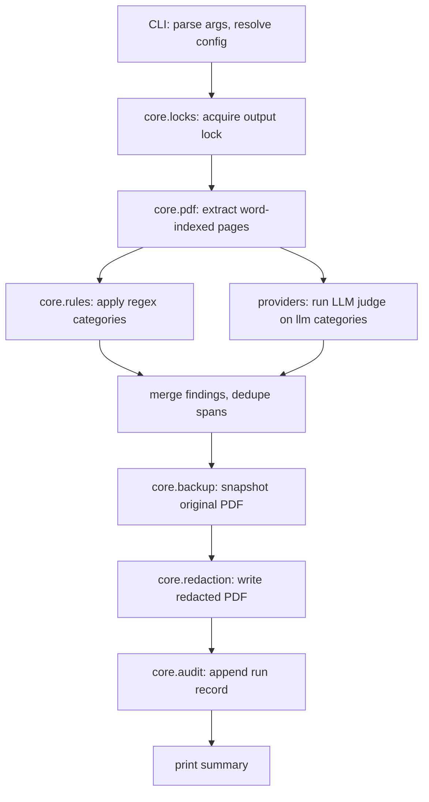

# Architecture

A 10,000-foot view of the kuroi codebase, the data flow through a single
`kuroi run`, and the invariants the design relies on.

## Module map

```
src/kuroi/
├── cli/              Typer entry points — one file per subcommand
├── core/             Pure-ish business logic; no Typer or HTTP imports
│   ├── pdf.py        PyMuPDF wrappers (word index, redaction)
│   ├── rules.py      RuleSet / Category dataclasses + YAML loader
│   ├── findings.py   The Finding dataclass — what every detector emits
│   ├── redaction.py  Apply Findings to a PDF (true PyMuPDF redaction)
│   ├── audit.py      Per-run audit JSONL writer
│   ├── audit_records.py  Audit record dataclasses
│   ├── backup.py     Pre-redaction backup + retention
│   ├── locks.py      Advisory lockfiles per output
│   ├── state.py      Resume-key store
│   ├── config.py     Config dataclasses + precedence resolver
│   ├── pricing.py    Per-provider/model token pricing
│   ├── output_resolution.py  -o / --in-place resolution
│   ├── verification.py       kuroi verify implementation
│   ├── diff.py       kuroi diff implementation
│   └── log.py        Logging setup
├── providers/        LLM client implementations
│   ├── base.py       Provider Protocol
│   ├── factory.py    Resolve config → Provider instance
│   ├── anthropic.py  Anthropic client
│   ├── ollama.py     Ollama client (httpx → /api/chat)
│   └── _shared.py    parse_findings_payload helper
├── rules/            Built-in YAML rule packs
│   └── pii-en.yaml
└── data/             Static assets (e.g., word lists)
```

The directional rule: `cli/` may import from `core/` and `providers/`,
but `core/` must not import from `cli/`. `providers/` only imports from
`core/`.

## Data flow for `kuroi run`



## Key invariants

- **Atomic writes.** Redacted output is written to a temp path and
  renamed; partial files never survive a crash.
- **Backup before redact.** `core.backup` always runs before
  `core.redaction`; `kuroi undo` is therefore always safe.
- **Audit completeness.** Every Finding emitted by any detector is
  recorded in the audit JSONL with its `source` field, regardless of
  whether it was applied to the PDF.
- **No PDF mutation in `core.pdf`.** That module only reads. Writes
  happen exclusively in `core.redaction` and `core.backup`.

## Where the LLM enters

`providers.base.Provider` is the only seam between core logic and an LLM.
Providers see word-indexed `Page` objects and a list of
`llm_category_ids` — they never touch the PDF binary directly.

## Where to look first

- Adding a new CLI subcommand → `cli/__init__.py` + a new `cli/<name>.py`.
- Adding a new detector category → edit `rules/pii-en.yaml` (regex) or
  add an LLM-handled category there + adjust the prompt in the
  appropriate provider.
- Adding a new LLM provider → see [Adding an LLM provider](adding-a-provider.md).
- Changing the on-disk audit format → `core/audit_records.py` (versioned
  schema; bump on breaking changes).
