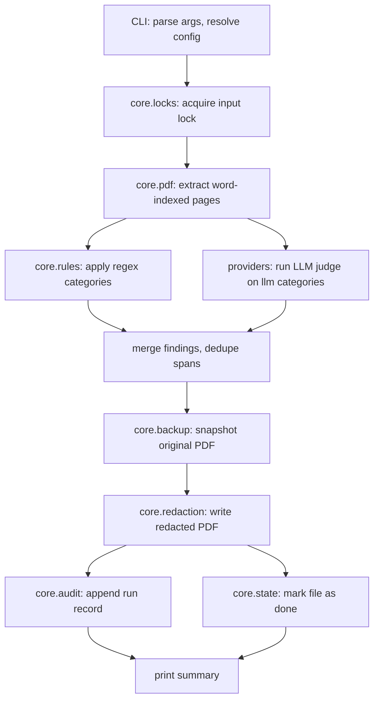

# MkDocs Documentation Implementation Plan

> **For agentic workers:** REQUIRED SUB-SKILL: Use superpowers:subagent-driven-development (recommended) or superpowers:executing-plans to implement this plan task-by-task. Steps use checkbox (`- [ ]`) syntax for tracking.

**Goal:** Stand up a complete Material-themed MkDocs documentation site for kuroi (CLI users + contributors + library consumers + rule authors), auto-deployed to GitHub Pages on merge to `main`.

**Architecture:** A single MkDocs project rooted at `mkdocs.yml`, sourcing from `docs/` (with `docs/superpowers/` excluded). Three audience-led top-level tabs (User Guide / Developer Guide / Reference) plus an About section. The Reference section is fully auto-generated — CLI from Typer via `mkdocs-typer2`, Python API via `mkdocstrings`, rule-pack schema via a `mkdocs-gen-files` script that introspects the `Category`/`RuleSet` dataclasses in `kuroi.core.rules`. Look is permanent dark (Material `slate` scheme) with an ICIJ red accent applied via `extra.css`. CI runs `mkdocs build --strict` on every PR; merges to `main` deploy via the official `actions/upload-pages-artifact` + `actions/deploy-pages` flow.

**Tech Stack:** MkDocs 1.6, mkdocs-material 9.5, mkdocs-typer2, `mkdocstrings[python]`, mkdocs-gen-files, mkdocs-literate-nav, pymdown-extensions, GitHub Actions.

**Spec:** `docs/superpowers/specs/2026-04-30-mkdocs-documentation-design.md`

---

## File Structure

**Created:**

- `mkdocs.yml`
- `CHANGELOG.md` (repo root, included into `about/changelog.md` via snippet)
- `docs/index.md`
- `docs/assets/logo.svg`, `docs/assets/favicon.svg`
- `docs/stylesheets/extra.css`
- `docs/_snippets/.gitkeep`
- `docs/user-guide/{install,quickstart,batch,providers,audit-and-undo,troubleshooting}.md`
- `docs/developer-guide/{architecture,contributing,library-usage,adding-a-provider,writing-rule-packs}.md`
- `docs/reference/cli.md` (single-page, auto-rendered by mkdocs-typer2)
- `docs/reference/api/{redaction,findings,rules,providers}.md`
- `docs/reference/rule-schema.md` (generated content; intro hand-written via gen_files script)
- `docs/reference/config.md`
- `docs/reference/exit-codes.md`
- `docs/about/changelog.md`
- `docs/about/license.md`
- `docs/_scripts/gen_rule_schema.py` (mkdocs-gen-files driver)
- `tests/docs/__init__.py`, `tests/docs/test_gen_rule_schema.py`
- `.github/workflows/docs.yml`

**Modified:**

- `pyproject.toml` (new `[project.optional-dependencies].docs` group, `tool.mkdocs` markers if any)
- `Makefile` (new `docs`, `docs-build` targets; `install` target installs `[dev,docs]`)
- `README.md` (add a 'Documentation' section linking to the published site)

**Excluded from build:** `docs/superpowers/` via `mkdocs.yml`'s `exclude_docs:`.

**Single-page CLI reference rationale:** The spec's IA shows `reference/cli/` as a subdirectory. This plan implements it as a single `reference/cli.md` page that `mkdocs-typer2` renders into per-command sections with anchored headings — the auto-gen contract (no drift) is fully preserved, the page-per-command split can be added later via a `gen_files` script if desired without breaking links. Documented here so the deviation from the spec layout is intentional and visible.

---

## Task 1: Bootstrap docs dependency group and minimal mkdocs.yml smoke build

**Files:**
- Modify: `pyproject.toml`
- Create: `mkdocs.yml`
- Create: `docs/index.md`

- [ ] **Step 1: Add the `docs` optional-dependencies group**

Edit `pyproject.toml` and append the new group inside `[project.optional-dependencies]` (alongside the existing `dev` group):

```toml
docs = [
    "mkdocs>=1.6",
    "mkdocs-material>=9.5",
    "mkdocs-typer2>=0.1",
    "mkdocstrings[python]>=0.27",
    "mkdocs-gen-files>=0.5",
    "mkdocs-literate-nav>=0.6",
    "pymdown-extensions>=10.7",
]
```

- [ ] **Step 2: Create the minimal `mkdocs.yml`**

Write to `mkdocs.yml`:

```yaml
site_name: kuroi
site_description: Strip sensitive data from PDFs with LLM assistance.
site_url: https://icij.github.io/kuroi/
repo_url: https://github.com/ICIJ/kuroi
repo_name: ICIJ/kuroi
edit_uri: edit/main/docs/
docs_dir: docs

theme:
  name: material
  language: en

nav:
  - Home: index.md
```

- [ ] **Step 3: Create the `docs/index.md` placeholder**

Write to `docs/index.md`:

```markdown
# kuroi

Strip sensitive data from PDFs with LLM assistance.
```

- [ ] **Step 4: Install the docs extra**

Run: `pip install -e ".[docs]"`
Expected: completes without resolution errors. Verify `mkdocs` is on PATH.

- [ ] **Step 5: Run the strict smoke build**

Run: `mkdocs build --strict`
Expected: builds into `site/`, exits 0, no warnings.

- [ ] **Step 6: Add `site/` to .gitignore**

If `site/` is not already ignored, append it to `.gitignore`:

```
site/
```

- [ ] **Step 7: Commit**

```bash
git add pyproject.toml mkdocs.yml docs/index.md .gitignore
git commit -m "docs: bootstrap mkdocs site with material theme"
```

---

## Task 2: Exclude internal `superpowers/` from the published site

**Files:**
- Modify: `mkdocs.yml`

- [ ] **Step 1: Add `exclude_docs` to `mkdocs.yml`**

Insert the following block after `docs_dir: docs`:

```yaml
exclude_docs: |
  superpowers/
```

- [ ] **Step 2: Verify the build still succeeds**

Run: `mkdocs build --strict`
Expected: exits 0.

- [ ] **Step 3: Verify the internal folder is not in the built site**

Run: `test ! -d site/superpowers && echo OK`
Expected: prints `OK`.

- [ ] **Step 4: Commit**

```bash
git add mkdocs.yml
git commit -m "docs: exclude internal superpowers/ from published site"
```

---

## Task 3: Apply the dark Material theme with ICIJ red accent

**Files:**
- Modify: `mkdocs.yml`
- Create: `docs/stylesheets/extra.css`

- [ ] **Step 1: Replace the theme block in `mkdocs.yml`**

Replace `theme:` with the full dark configuration:

```yaml
theme:
  name: material
  language: en
  palette:
    scheme: slate
    primary: black
    accent: red
  font:
    text: Inter
    code: JetBrains Mono
  features:
    - navigation.tabs
    - navigation.tabs.sticky
    - navigation.sections
    - navigation.indexes
    - navigation.top
    - navigation.footer
    - toc.follow
    - search.suggest
    - search.highlight
    - content.code.copy
    - content.code.annotate
    - content.tabs.link

extra_css:
  - stylesheets/extra.css
```

- [ ] **Step 2: Create the CSS overrides**

Write to `docs/stylesheets/extra.css`:

```css
/* kuroi — dark slate overrides + ICIJ red accent */

[data-md-color-scheme="slate"] {
  --md-default-bg-color: #0f1115;
  --md-default-fg-color: #e6e6e6;
  --md-default-fg-color--light: #c8c8c8;
  --md-default-fg-color--lighter: #9a9a9a;

  --md-primary-fg-color: #07080a;
  --md-primary-bg-color: #f5f5f5;

  --md-accent-fg-color: #d62828;
  --md-accent-fg-color--transparent: rgba(214, 40, 40, 0.10);

  --md-typeset-a-color: #ff5a5a;

  --md-code-bg-color: #15171c;
  --md-code-fg-color: #e6e6e6;
}

/* Lift fenced code blocks off the page background without a border. */
.md-typeset pre > code {
  background-color: var(--md-code-bg-color);
}

/* Subtle accent underline on links instead of the default Material highlight. */
.md-typeset a:hover {
  color: var(--md-accent-fg-color);
}
```

- [ ] **Step 3: Verify the strict build**

Run: `mkdocs build --strict`
Expected: exits 0.

- [ ] **Step 4: Visually confirm the theme**

Run: `mkdocs serve -a 127.0.0.1:8000` then open the URL.
Expected: dark page background, header is near-black, links/hover use red accent. Stop the server with Ctrl-C.

- [ ] **Step 5: Commit**

```bash
git add mkdocs.yml docs/stylesheets/extra.css
git commit -m "docs: apply dark slate theme with icij red accent"
```

---

## Task 4: Add placeholder logo and favicon

**Files:**
- Create: `docs/assets/logo.svg`
- Create: `docs/assets/favicon.svg`
- Modify: `mkdocs.yml`

- [ ] **Step 1: Create the placeholder logo wordmark**

Write to `docs/assets/logo.svg`:

```svg
<svg xmlns="http://www.w3.org/2000/svg" viewBox="0 0 200 64" role="img" aria-label="kuroi">
  <rect width="200" height="64" fill="none"/>
  <text x="0" y="44" font-family="Inter, system-ui, sans-serif" font-size="40" font-weight="700" fill="#ffffff">kuroi</text>
  <rect x="138" y="38" width="10" height="10" fill="#d62828"/>
</svg>
```

- [ ] **Step 2: Create the placeholder favicon**

Write to `docs/assets/favicon.svg`:

```svg
<svg xmlns="http://www.w3.org/2000/svg" viewBox="0 0 32 32">
  <rect width="32" height="32" fill="#0f1115"/>
  <rect x="6" y="6" width="20" height="20" fill="#d62828"/>
  <rect x="11" y="11" width="10" height="10" fill="#0f1115"/>
</svg>
```

- [ ] **Step 3: Wire the assets into `theme:`**

Add the following two lines under `theme:` in `mkdocs.yml`, indented at the same level as `name:`:

```yaml
  logo: assets/logo.svg
  favicon: assets/favicon.svg
```

- [ ] **Step 4: Verify the strict build**

Run: `mkdocs build --strict`
Expected: exits 0; `site/assets/logo.svg` and `site/assets/favicon.svg` exist.

- [ ] **Step 5: Commit**

```bash
git add docs/assets/logo.svg docs/assets/favicon.svg mkdocs.yml
git commit -m "docs: add placeholder logo and favicon"
```

> **TODO:** Replace placeholder SVGs with final ICIJ artwork in a follow-up PR.

---

## Task 5: Wire up markdown extensions and the snippets directory

**Files:**
- Modify: `mkdocs.yml`
- Create: `docs/_snippets/.gitkeep`

- [ ] **Step 1: Append the `markdown_extensions` and `plugins` blocks to `mkdocs.yml`**

Add at the bottom of `mkdocs.yml`:

```yaml
markdown_extensions:
  - admonition
  - attr_list
  - md_in_html
  - tables
  - toc:
      permalink: true
  - pymdownx.details
  - pymdownx.superfences:
      custom_fences:
        - name: mermaid
          class: mermaid
          format: !!python/name:pymdownx.superfences.fence_code_format
  - pymdownx.tabbed:
      alternate_style: true
  - pymdownx.snippets:
      base_path:
        - docs/_snippets
        - .
      check_paths: true
  - pymdownx.highlight:
      anchor_linenums: true
      line_spans: __span
      pygments_lang_class: true
  - pymdownx.inlinehilite
  - pymdownx.keys

plugins:
  - search
```

- [ ] **Step 2: Create the snippets directory**

Run: `mkdir -p docs/_snippets && touch docs/_snippets/.gitkeep`

- [ ] **Step 3: Verify the strict build**

Run: `mkdocs build --strict`
Expected: exits 0. (Note: `pymdownx.superfences` uses `!!python/name:` which requires `mkdocs.yml` to be loaded with the unsafe loader — Material handles this via its `mkdocs.yaml` patch out of the box.)

- [ ] **Step 4: Commit**

```bash
git add mkdocs.yml docs/_snippets/.gitkeep
git commit -m "docs: enable markdown extensions and snippets directory"
```

---

## Task 6: Scaffold the full nav with placeholder pages

**Goal:** With every nav-listed page existing as a stub, every subsequent task can replace one page's content without breaking the strict build.

**Files:**
- Modify: `mkdocs.yml`
- Create (placeholder content for each):
  - `docs/user-guide/install.md`
  - `docs/user-guide/quickstart.md`
  - `docs/user-guide/batch.md`
  - `docs/user-guide/providers.md`
  - `docs/user-guide/audit-and-undo.md`
  - `docs/user-guide/troubleshooting.md`
  - `docs/developer-guide/architecture.md`
  - `docs/developer-guide/contributing.md`
  - `docs/developer-guide/library-usage.md`
  - `docs/developer-guide/adding-a-provider.md`
  - `docs/developer-guide/writing-rule-packs.md`
  - `docs/reference/cli.md`
  - `docs/reference/api/redaction.md`
  - `docs/reference/api/findings.md`
  - `docs/reference/api/rules.md`
  - `docs/reference/api/providers.md`
  - `docs/reference/rule-schema.md`
  - `docs/reference/config.md`
  - `docs/reference/exit-codes.md`
  - `docs/about/changelog.md`
  - `docs/about/license.md`

- [ ] **Step 1: Replace the `nav:` block in `mkdocs.yml`**

Replace the existing `nav:` block with:

```yaml
nav:
  - Home: index.md
  - User Guide:
      - Install: user-guide/install.md
      - Quick start: user-guide/quickstart.md
      - Batch redaction: user-guide/batch.md
      - LLM providers: user-guide/providers.md
      - Audit, diff, undo & backups: user-guide/audit-and-undo.md
      - Troubleshooting: user-guide/troubleshooting.md
  - Developer Guide:
      - Architecture: developer-guide/architecture.md
      - Contributing: developer-guide/contributing.md
      - Using kuroi as a library: developer-guide/library-usage.md
      - Adding an LLM provider: developer-guide/adding-a-provider.md
      - Writing rule packs: developer-guide/writing-rule-packs.md
  - Reference:
      - CLI: reference/cli.md
      - Python API:
          - kuroi.core.redaction: reference/api/redaction.md
          - kuroi.core.findings: reference/api/findings.md
          - kuroi.core.rules: reference/api/rules.md
          - kuroi.providers.base: reference/api/providers.md
      - Rule schema: reference/rule-schema.md
      - Configuration: reference/config.md
      - Exit codes: reference/exit-codes.md
  - About:
      - Changelog: about/changelog.md
      - License: about/license.md
```

- [ ] **Step 2: Create every placeholder page**

For each path listed in **Files** above, write a single-line file with one H1. Example for `docs/user-guide/install.md`:

```markdown
# Install
```

Repeat for every file with the obvious title (use the nav label as the H1: e.g. `# Quick start`, `# Batch redaction`, `# kuroi.core.redaction`, `# License`, etc.).

For the API stubs specifically, use the module path as the H1 (e.g., `# kuroi.core.redaction`).

- [ ] **Step 3: Verify the strict build with the full nav**

Run: `mkdocs build --strict`
Expected: exits 0; no `Doc file ... not included in nav` warnings; the four top tabs visible if you run `mkdocs serve`.

- [ ] **Step 4: Commit**

```bash
git add mkdocs.yml docs/
git commit -m "docs: scaffold full nav with placeholder pages"
```

---

## Task 7: Write the home page

**Files:**
- Modify: `docs/index.md`

- [ ] **Step 1: Replace `docs/index.md` with the real intro and three-card grid**

Write:

```markdown
---
hide:
  - toc
---

# kuroi

Strip sensitive data from PDFs with LLM assistance.

kuroi is a command-line tool that removes personally identifiable information
(PII) and other sensitive content from PDF files. It combines deterministic
regex rules with an LLM judge so that names, addresses, and other contextual
identifiers can be detected even when they don't match a fixed pattern. Every
run produces an auditable record and a backup, so you can verify what was
removed and restore the original at any time.

## 30-second demo

```sh
$ export ANTHROPIC_API_KEY=sk-ant-...
$ kuroi run report.pdf
✓ Detected 47 findings across 12 pages (32 regex, 15 llm)
✓ Wrote redacted file: report.redacted.pdf
✓ Backup at: ~/.local/state/kuroi/backups/report-20260430-093102.pdf
```

## Get started

<div class="grid cards" markdown>

- :material-download: __[Install](user-guide/install.md)__

    Get kuroi onto your machine in under a minute.

- :material-rocket-launch: __[Quick start](user-guide/quickstart.md)__

    Redact your first PDF end-to-end.

- :material-book-open-variant: __[Use as a library](developer-guide/library-usage.md)__

    Integrate kuroi into your own Python pipeline.

</div>
```

- [ ] **Step 2: Enable the `material.extensions` grid feature**

Material's grid cards work out of the box with `attr_list` + `md_in_html` (already enabled in Task 5). No additional config needed.

- [ ] **Step 3: Verify the strict build**

Run: `mkdocs build --strict`
Expected: exits 0.

- [ ] **Step 4: Commit**

```bash
git add docs/index.md
git commit -m "docs: write home page intro and demo"
```

---

## Task 8: Write `user-guide/install.md`

**Files:**
- Modify: `docs/user-guide/install.md`

- [ ] **Step 1: Replace the placeholder with full install instructions**

Write to `docs/user-guide/install.md`:

````markdown
# Install

kuroi runs on Python 3.12 or newer. Pick whichever installation method
matches your workflow.

## Installation methods

=== "pip"

    ```sh
    pip install kuroi
    ```

=== "uv (recommended for end users)"

    ```sh
    uv tool install kuroi
    ```

    `uv tool install` puts `kuroi` on your PATH inside an isolated
    environment, so it never collides with your project dependencies.

=== "From source"

    ```sh
    git clone https://github.com/ICIJ/kuroi.git
    cd kuroi
    pip install -e .
    ```

## System requirements

- **Python 3.12 or newer.** Earlier versions are not supported.
- **An LLM provider.** Either an Anthropic API key (cloud) or a running
  [Ollama](https://ollama.ai) instance (local). See [LLM providers](providers.md).
- **PDFs you have permission to redact.** kuroi never uploads files; only
  extracted text snippets are sent to the LLM.

## Verify the install

```sh
$ kuroi --version
kuroi 0.1.0

$ kuroi doctor
✓ Python 3.12.4
✓ Provider: anthropic (model: claude-opus-4-7)
✓ Configuration directory: ~/.config/kuroi/
✓ Ready
```

If `kuroi doctor` flags any issue, the [Troubleshooting](troubleshooting.md)
page lists the common fixes.

## Next steps

- [Quick start](quickstart.md) — redact your first PDF.
- [LLM providers](providers.md) — set up Anthropic or Ollama.
````

- [ ] **Step 2: Verify the strict build**

Run: `mkdocs build --strict`
Expected: exits 0.

- [ ] **Step 3: Commit**

```bash
git add docs/user-guide/install.md
git commit -m "docs: write install guide"
```

---

## Task 9: Write `user-guide/quickstart.md`

**Files:**
- Modify: `docs/user-guide/quickstart.md`

- [ ] **Step 1: Replace the placeholder with the end-to-end walkthrough**

Write to `docs/user-guide/quickstart.md`:

````markdown
# Quick start

Redact your first PDF in under five minutes.

## 1. Set your provider key

kuroi defaults to Anthropic. Export your API key once per shell, or add it
to your shell rc file:

```sh
export ANTHROPIC_API_KEY=sk-ant-...
```

If you want to stay fully offline, use [Ollama](providers.md#ollama)
instead — no API key required.

## 2. Run the redactor

```sh
$ kuroi run report.pdf
```

kuroi prints a live-updating Rich progress display:

```
[1/1] report.pdf
  Extracting words ........ done (12 pages, 4,832 words)
  Applying regex rules .... 32 findings
  LLM judge ............... 15 findings
  Writing redacted PDF .... ✓
  Backup .................. ~/.local/state/kuroi/backups/report-20260430-093102.pdf
```

The redacted file is written next to the input as `report.redacted.pdf`
by default. See [Batch redaction](batch.md) for output-resolution rules.

## 3. Inspect the diff

To see what kuroi changed, run:

```sh
$ kuroi diff report.pdf
```

The diff shows each finding by page, category, and word range — colour-coded
by confidence (high / medium / low).

## 4. Restore if you need to

If anything looks wrong, restore the latest backup:

```sh
$ kuroi undo report.pdf
```

`kuroi undo` writes the original back into place. Backups are kept for
24 hours by default; tune the retention via [`kuroi config`](../reference/config.md).

## What just happened?

1. kuroi ran the [PII rule pack](../developer-guide/writing-rule-packs.md)
   over the PDF text using regex.
2. Snippets the regex couldn't classify were sent to the configured LLM
   for context-aware judgement.
3. PyMuPDF rewrote the content stream so the redacted text is no longer
   recoverable, not just covered with a black box.
4. A full audit record was written so you can always trace why a span
   was redacted. See [Audit & undo](audit-and-undo.md).

## Next steps

- [Batch redaction](batch.md) — process a folder of PDFs.
- [LLM providers](providers.md) — switch to local-only Ollama.
- [Audit, diff, undo & backups](audit-and-undo.md) — verify and reverse.
````

- [ ] **Step 2: Verify the strict build**

Run: `mkdocs build --strict`
Expected: exits 0.

- [ ] **Step 3: Commit**

```bash
git add docs/user-guide/quickstart.md
git commit -m "docs: write quick start walkthrough"
```

---

## Task 10: Write `user-guide/batch.md`

**Files:**
- Modify: `docs/user-guide/batch.md`

- [ ] **Step 1: Replace the placeholder**

Write to `docs/user-guide/batch.md`:

````markdown
# Batch redaction

Run kuroi over a folder of PDFs in one go, with cost estimation and
resumable state.

## Globbing a folder

```sh
$ kuroi run ./inbox/*.pdf
```

Or recursively:

```sh
$ kuroi run ./inbox/**/*.pdf
```

kuroi processes each file independently and prints a per-file progress
line. A summary is written at the end.

## Output resolution

By default, every redacted file is written next to the input as
`<name>.redacted.pdf`. Override the destination with `--output-dir`:

```sh
$ kuroi run ./inbox/*.pdf --output-dir ./redacted/
```

The directory tree of the inputs is preserved under `--output-dir`. If a
target file already exists, kuroi refuses to overwrite it unless you pass
`--force`.

## Cost estimation

Before running a large batch against a paid provider, dry-run the cost:

```sh
$ kuroi run ./inbox/*.pdf --estimate
Estimated cost: $0.84 across 50 files (claude-opus-4-7 @ ICIJ pricing)
Run again without --estimate to proceed.
```

The estimate uses the per-token pricing baked into `kuroi.core.pricing`
(refresh it with `kuroi config refresh-pricing`).

## Resuming an interrupted batch

If a batch is interrupted (`Ctrl-C`, network drop, machine restart),
re-running the same command picks up where it left off. State is kept in
`~/.local/state/kuroi/state/` keyed by input file content hash, so a
half-finished file is re-attempted from scratch but completed files are
skipped.

```sh
$ kuroi run ./inbox/*.pdf
[3/50] invoice-april.pdf .......... ✓ (cached, skipped)
[4/50] invoice-may.pdf ............ running ...
```

## Parallelism

Process multiple files concurrently with `--workers`:

```sh
$ kuroi run ./inbox/*.pdf --workers 4
```

Default is 1 (sequential). Increase cautiously when using a paid provider
— concurrent requests multiply your spend.

## Worked example: 50 quarterly invoices

```sh
$ export ANTHROPIC_API_KEY=sk-ant-...
$ kuroi run ./invoices/Q1/*.pdf --output-dir ./redacted/Q1/ --estimate
Estimated cost: $0.84

$ kuroi run ./invoices/Q1/*.pdf --output-dir ./redacted/Q1/ --workers 4
[1/50] inv-001.pdf ................ ✓ (3.2s)
...
[50/50] inv-050.pdf ............... ✓ (2.9s)

Summary: 50/50 succeeded, 412 findings, 0 errors, $0.81 spent
```

## Next steps

- [LLM providers](providers.md) — switch to free, local Ollama for batches.
- [Audit & undo](audit-and-undo.md) — review the diff for one file in the batch.
````

- [ ] **Step 2: Verify the strict build**

Run: `mkdocs build --strict`
Expected: exits 0.

- [ ] **Step 3: Commit**

```bash
git add docs/user-guide/batch.md
git commit -m "docs: write batch redaction guide"
```

---

## Task 11: Write `user-guide/providers.md`

**Files:**
- Modify: `docs/user-guide/providers.md`

- [ ] **Step 1: Replace the placeholder**

Write to `docs/user-guide/providers.md`:

````markdown
# LLM providers

kuroi uses an LLM as a "judge" to spot context-sensitive redactions that
plain regex misses. Two providers ship with kuroi.

## Provider comparison

| Provider | Hosting | API key required | Cost | Best for |
| --- | --- | --- | --- | --- |
| **Anthropic** | Cloud | Yes (`ANTHROPIC_API_KEY`) | Per-token | Highest-quality detection on small batches. |
| **Ollama** | Local | No | Free (your hardware) | Offline workflows; sensitive data that must not leave the host. |

## List available models

```sh
$ kuroi models
Anthropic
  claude-opus-4-7         (default)
  claude-sonnet-4-6
  claude-haiku-4-5

Ollama (http://localhost:11434)
  llama3.1:8b
  llama3.1:70b
```

If Ollama is not running, the Ollama section reports `unreachable`.

## Configure a provider

=== "Anthropic"

    ```sh
    $ export ANTHROPIC_API_KEY=sk-ant-...
    $ kuroi run document.pdf --provider anthropic --model claude-opus-4-7
    ```

    Or persist it:

    ```sh
    $ kuroi config set provider anthropic
    $ kuroi config set model claude-opus-4-7
    ```

=== "Ollama"

    ```sh
    $ ollama serve &  # start the daemon if it's not already running
    $ ollama pull llama3.1:8b
    $ kuroi run document.pdf --provider ollama --model llama3.1:8b
    ```

    Or persist it:

    ```sh
    $ kuroi config set provider ollama
    $ kuroi config set model llama3.1:8b
    $ kuroi config set ollama_url http://localhost:11434
    ```

## Configuration precedence

kuroi resolves configuration in this order (later overrides earlier):

1. Built-in defaults.
2. `~/.config/kuroi/config.toml` (or `$XDG_CONFIG_HOME/kuroi/config.toml`).
3. Environment variables (`ANTHROPIC_API_KEY`, `KUROI_PROVIDER`, `KUROI_MODEL`).
4. CLI flags (`--provider`, `--model`, `--ollama-url`).

See [Configuration](../reference/config.md) for the full key list.

## Fully offline workflow

1. Install [Ollama](https://ollama.ai).
2. Pull a model: `ollama pull llama3.1:8b`.
3. `kuroi config set provider ollama && kuroi config set model llama3.1:8b`.
4. Run `kuroi run document.pdf`. No outbound HTTP except to `localhost`.

## Switching providers mid-project

You can change provider per-invocation without losing state. The audit
record stores which provider produced each finding:

```sh
$ kuroi run document.pdf --provider anthropic
$ kuroi diff document.pdf | head
  page 3, words 12-13   email           anthropic    high
  page 3, word 88       phone           rules:pii-en high
  ...
```

## Next steps

- [Audit & undo](audit-and-undo.md) — verify a redaction independently of
  the provider that produced it.
- [Adding an LLM provider](../developer-guide/adding-a-provider.md) — write
  a custom backend for a self-hosted model.
````

- [ ] **Step 2: Verify the strict build**

Run: `mkdocs build --strict`
Expected: exits 0.

- [ ] **Step 3: Commit**

```bash
git add docs/user-guide/providers.md
git commit -m "docs: write llm providers guide"
```

---

## Task 12: Write `user-guide/audit-and-undo.md`

**Files:**
- Modify: `docs/user-guide/audit-and-undo.md`

- [ ] **Step 1: Replace the placeholder**

Write to `docs/user-guide/audit-and-undo.md`:

````markdown
# Audit, diff, undo & backups

Every kuroi run is reversible and auditable. This page covers the four
commands you need to inspect, verify, restore, and clean up.

## See what changed: `kuroi diff`

```sh
$ kuroi diff report.pdf
report.pdf  →  report.redacted.pdf

  page 3, words 12-13   email          anthropic    high      "j.doe@example.com"
  page 3, word 88       phone          rules:pii-en high      "+33 6 12 34 56 78"
  page 7, words 22-25   person_name    anthropic    medium    "Jane M. Doe"
  ...

47 findings (32 regex, 15 llm)
```

`--include-text` and `--exclude-text` filter the listing. Use `--json`
for machine-readable output.

## Re-check a redacted PDF: `kuroi verify`

`verify` runs the same regex rules over the redacted output to catch
anything that slipped through:

```sh
$ kuroi verify report.redacted.pdf
✓ No regex matches detected
```

If it finds anything, the exit code is non-zero and the leaked spans are
listed. Wire `kuroi verify` into your batch pipeline as a gate.

## Restore the original: `kuroi undo`

```sh
$ kuroi undo report.pdf
✓ Restored report.pdf from backup report-20260430-093102.pdf
```

`undo` finds the most recent backup matching the input filename and
copies it back over the redacted output. The backup is retained.

## List & garbage-collect backups

```sh
$ kuroi backups list
report-20260430-093102.pdf   124 KB    today, 09:31
report-20260429-141522.pdf   118 KB    yesterday
invoice-20260428-080001.pdf   42 KB    2 days ago
```

!!! warning "Destructive: review before running"
    `kuroi backups gc` permanently deletes backups older than the retention
    window (default: 24h). Pass `--dry-run` first to preview.

```sh
$ kuroi backups gc --dry-run
Would delete 3 backups (oldest: 2 days ago)

$ kuroi backups gc
Deleted 3 backups, 318 KB freed.
```

Tune retention with:

```sh
$ kuroi config set backup_retention_hours 168   # one week
```

## Where audit logs live

Each run writes a JSONL record to:

```
~/.local/state/kuroi/audit/<input-hash>/<run-id>.jsonl
```

One line per finding. The schema lives in
`src/kuroi/core/audit_records.py`. Use
`kuroi config set audit_include_text true` if you want the matched
snippets stored in the audit log (off by default — opt-in because audit
logs themselves can be sensitive).

## Next steps

- [Troubleshooting](troubleshooting.md) — when `kuroi verify` flags a leak.
- [Configuration](../reference/config.md) — every audit/backup setting.
````

- [ ] **Step 2: Verify the strict build**

Run: `mkdocs build --strict`
Expected: exits 0.

- [ ] **Step 3: Commit**

```bash
git add docs/user-guide/audit-and-undo.md
git commit -m "docs: write audit, diff, undo and backups guide"
```

---

## Task 13: Write `user-guide/troubleshooting.md`

**Files:**
- Modify: `docs/user-guide/troubleshooting.md`

- [ ] **Step 1: Replace the placeholder**

Write to `docs/user-guide/troubleshooting.md`:

````markdown
# Troubleshooting

Common failures and how to fix them. Run `kuroi doctor` first — it checks
most of these in one go.

## `kuroi doctor` output

```sh
$ kuroi doctor
✓ Python 3.12.4
✓ Provider: anthropic (model: claude-opus-4-7)
✗ ANTHROPIC_API_KEY not set
✓ Configuration directory: ~/.config/kuroi/
```

The first failing line tells you what to fix.

## "ANTHROPIC_API_KEY not set"

```sh
$ export ANTHROPIC_API_KEY=sk-ant-...
```

Persist by adding the export to your shell rc file. Or switch to Ollama
for offline runs (see [LLM providers](providers.md)).

## "File is locked" / `LockTimeout`

kuroi uses an advisory lock file alongside each input PDF to prevent two
runs from racing on the same file. If a previous run crashed without
releasing the lock, remove the stray `<pdf>.kuroi.lock` file:

```sh
$ rm path/to/document.pdf.kuroi.lock
```

## Provider rate limits

If you see `429 Too Many Requests` from Anthropic, lower `--workers` and
re-run; kuroi resumes where it stopped.

## "PDF is too large to extract"

Very large PDFs (hundreds of megabytes / thousands of pages) may exceed
PyMuPDF's word-extraction limits. Split the file with
`pymupdf.open(...).save(..., from=, to=)` or `pdftk`, redact each part,
then re-merge.

## "Verification gate failed"

`kuroi verify` re-runs the regex rules over a redacted output. If it
flags a match, the original redaction missed it. Re-run with `--seed`
fixed and `-vv` to see the LLM's reasoning, then file an issue with the
audit record attached.

## Where logs live

- **Audit records (per finding):** `~/.local/state/kuroi/audit/<hash>/<run>.jsonl`
- **Backups (full PDFs):** `~/.local/state/kuroi/backups/`
- **State (resume info):** `~/.local/state/kuroi/state/`
- **Config:** `~/.config/kuroi/config.toml`

`-v` (info) and `-vv` (debug) on any command print a runtime trace to
stderr.

## Still stuck?

Open an issue at [github.com/ICIJ/kuroi/issues](https://github.com/ICIJ/kuroi/issues)
with:

1. The command you ran.
2. `kuroi --version` and `kuroi doctor` output.
3. The relevant audit JSONL excerpt (with `audit_include_text=false` so
   you don't leak the data you're trying to redact).
````

- [ ] **Step 2: Verify the strict build**

Run: `mkdocs build --strict`
Expected: exits 0.

- [ ] **Step 3: Commit**

```bash
git add docs/user-guide/troubleshooting.md
git commit -m "docs: write troubleshooting guide"
```

---

## Task 14: Write `developer-guide/architecture.md` with mermaid diagram

**Files:**
- Modify: `docs/developer-guide/architecture.md`

Mermaid is already wired via the `pymdownx.superfences` custom fence in
Task 5. mkdocs-material 9.x auto-loads the mermaid runtime when it sees
that fence, so no `extra_javascript` entry is needed. The slate scheme
also activates the dark mermaid theme automatically.

- [ ] **Step 1: Replace the placeholder**

Write to `docs/developer-guide/architecture.md`:

````markdown
# Architecture

A 10,000-foot view of the kuroi codebase, the data flow through a single
`kuroi run`, and the invariants the design relies on.

## Module map

```
src/kuroi/
├── cli/              Typer entry points — one file per subcommand
├── core/             Pure-ish business logic; no Typer or HTTP imports
│   ├── pdf.py        PyMuPDF wrappers (word index, redaction)
│   ├── rules.py      RuleSet / Category dataclasses + YAML loader
│   ├── findings.py   The Finding dataclass — what every detector emits
│   ├── redaction.py  Apply Findings to a PDF (true PyMuPDF redaction)
│   ├── audit.py      Per-run audit JSONL writer
│   ├── audit_records.py  Audit record dataclasses
│   ├── backup.py     Pre-redaction backup + retention
│   ├── locks.py      Advisory lockfiles per input
│   ├── state.py      Resume-key store (input hash → run state)
│   ├── config.py     Config dataclasses + precedence resolver
│   ├── pricing.py    Per-provider/model token pricing
│   ├── output_resolution.py  --output-dir + suffix logic
│   ├── verification.py       kuroi verify implementation
│   ├── diff.py       kuroi diff implementation
│   └── log.py        Logging setup
├── providers/        LLM client implementations
│   ├── base.py       Provider Protocol
│   ├── factory.py    Resolve config → Provider instance
│   ├── anthropic.py  Anthropic client
│   ├── ollama.py     Ollama client
│   └── _shared.py    Common chunking/prompt helpers
├── rules/            Built-in YAML rule packs
│   └── pii-en.yaml
└── data/             Static assets (e.g., word lists)
```

The directional rule: `cli/` may import from `core/` and `providers/`,
but `core/` must not import from `cli/`. `providers/` only imports from
`core/`.

## Data flow for `kuroi run`



## Key invariants

- **Atomic writes.** Redacted output is written to a temp path and
  renamed; partial files never survive a crash.
- **Backup before redact.** `core.backup` always runs before
  `core.redaction`; `kuroi undo` is therefore always safe.
- **Idempotent resume.** A run keyed by `(content_hash, ruleset_version,
  provider, model)` is skipped if previously completed. State lives in
  `core.state`.
- **Audit completeness.** Every Finding emitted by any detector is
  recorded in the audit JSONL with its `source` field, regardless of
  whether it was applied to the PDF.
- **No PDF mutation in `core.pdf`.** That module only reads. Writes
  happen exclusively in `core.redaction` and `core.backup`.

## Where the LLM enters

`providers.base.Provider` is the only seam between core logic and an LLM.
Providers see word-indexed `Page` objects and a list of
`llm_category_ids` — they never touch the PDF binary directly.

## Where to look first

- Adding a new CLI subcommand → `cli/__init__.py` + a new `cli/<name>.py`.
- Adding a new detector category → edit `rules/pii-en.yaml` (regex) or
  add an LLM-handled category there + update the prompt in
  `providers/_shared.py`.
- Adding a new LLM provider → see [Adding an LLM provider](adding-a-provider.md).
- Changing the on-disk audit format → `core/audit_records.py` (versioned
  schema; bump on breaking changes).
````

- [ ] **Step 2: Verify the strict build**

Run: `mkdocs build --strict`
Expected: exits 0.

- [ ] **Step 3: Commit**

```bash
git add docs/developer-guide/architecture.md
git commit -m "docs: write architecture overview with mermaid diagram"
```

---

## Task 15: Write `developer-guide/contributing.md`

**Files:**
- Modify: `docs/developer-guide/contributing.md`

- [ ] **Step 1: Replace the placeholder**

Write to `docs/developer-guide/contributing.md`:

````markdown
# Contributing

Welcome. kuroi is small and focused — your first PR can be merged in a day.

## Dev setup

```sh
$ git clone https://github.com/ICIJ/kuroi.git
$ cd kuroi
$ make install         # editable install with dev + docs extras
$ make doctor
```

`make install` installs both the `dev` and `docs` extras so you can run
the test suite, type checks, and the docs site from one checkout.

## Common Makefile targets

| Target           | What it does                                         |
| ---------------- | ---------------------------------------------------- |
| `make test`      | Run the pytest suite.                                |
| `make coverage`  | Run pytest with a coverage report.                   |
| `make lint`      | `ruff check` + `ruff format --check`.                |
| `make format`    | Auto-format with ruff.                               |
| `make typecheck` | Run mypy in strict mode.                             |
| `make docs`      | Serve the docs locally at http://127.0.0.1:8000.     |
| `make docs-build`| Run `mkdocs build --strict` (matches CI).            |
| `make clean`     | Remove caches and build artifacts.                   |

## Running the docs site

```sh
$ make docs
INFO    -  Serving on http://127.0.0.1:8000/
```

The site live-reloads on every file save. Before opening a PR that
touches docs, run `make docs-build` — that's the same command CI runs,
and it fails on any unresolved link or missing nav entry.

## Commit conventions

We use [Conventional Commits](https://www.conventionalcommits.org/).
Common types:

- `feat:` — new user-visible feature.
- `fix:` — bug fix.
- `docs:` — docs changes.
- `refactor:` — internal change with no user-visible effect.
- `test:` — test-only changes.
- `chore:` / `build:` / `ci:` — tooling, deps, workflows.

Subject line ≤ 72 characters, lowercase. No body required for small
changes.

## How the auto-generated reference works

Three reference pages are generated from code, not hand-edited:

- **CLI reference** (`docs/reference/cli.md`) — rendered by
  `mkdocs-typer2` from the live `kuroi.cli:app`. Adding or renaming a
  Typer command updates the docs automatically.
- **Python API reference** (`docs/reference/api/*.md`) — rendered by
  `mkdocstrings` from the docstrings on the public modules.
  **Docstrings on the listed modules are part of the public contract.**
- **Rule schema reference** (`docs/reference/rule-schema.md`) — generated
  by `docs/_scripts/gen_rule_schema.py`, which introspects the `Category`
  and `RuleSet` dataclasses in `kuroi.core.rules`.

If your PR removes or renames a public Typer command, public function,
or rule-schema field, run `make docs-build` locally — `--strict` will
fail if any hand-written prose page links to a symbol that no longer
exists. Update the cross-references in the same PR.

## One-time setup notes

- **GitHub Pages source.** On first deploy, a maintainer must set the
  Pages source to "GitHub Actions" in
  `Settings → Pages → Build and deployment → Source` on the GitHub UI.
  The deploy workflow does the rest.

## Getting changes merged

1. Open a PR. CI runs lint, typecheck, tests, and the strict docs build.
2. A maintainer reviews. Squash-merge.
3. The docs auto-deploy when `main` updates.
````

- [ ] **Step 2: Verify the strict build**

Run: `mkdocs build --strict`
Expected: exits 0.

- [ ] **Step 3: Commit**

```bash
git add docs/developer-guide/contributing.md
git commit -m "docs: write contributing guide"
```

---

## Task 16: Write `developer-guide/library-usage.md`

**Files:**
- Modify: `docs/developer-guide/library-usage.md`

- [ ] **Step 1: Replace the placeholder**

Write to `docs/developer-guide/library-usage.md`:

````markdown
# Using kuroi as a library

kuroi can be imported into a Python pipeline. This page covers the
stable public API; everything else (anything not listed here) is
internal and may change without notice.

## The public surface

| Symbol                                     | Purpose                                       |
| ------------------------------------------ | --------------------------------------------- |
| `kuroi.core.redaction.apply_redactions`    | Write a redacted copy of a PDF.               |
| `kuroi.core.findings.Finding`              | The detector output type.                     |
| `kuroi.core.findings.bbox_union`           | Merge bounding boxes over a span.             |
| `kuroi.core.rules.RuleSet` / `Category`    | Rule pack data types.                         |
| `kuroi.core.rules.load_rule_set`           | Load a built-in rule pack by name.            |
| `kuroi.core.rules.apply_regex_rules`       | Run the regex categories over word-indexed pages. |
| `kuroi.core.pdf.extract_word_index`        | Extract word-indexed pages from a PDF.        |
| `kuroi.providers.base.Provider`            | The Protocol every LLM client implements.     |
| `kuroi.providers.factory.make_provider`    | Build a provider from a `Config`.             |
| `kuroi.core.config.Config`                 | The resolved configuration.                   |
| `kuroi.core.config.resolve_config`         | Resolve config from CLI/env/file/defaults.    |

For the full type signatures, see [the Python API reference](../reference/api/redaction.md).

## Minimal example

```python
from pathlib import Path

from kuroi.core.config import resolve_config, ConfigOverrides
from kuroi.core.pdf import extract_word_index
from kuroi.core.redaction import apply_redactions
from kuroi.core.rules import apply_regex_rules, llm_categories, load_rule_set
from kuroi.providers.factory import make_provider

cfg = resolve_config(ConfigOverrides())              # CLI flags first → env → file → defaults
ruleset = load_rule_set("pii-en")
pages = extract_word_index(Path("report.pdf"))

# Regex pass
findings = apply_regex_rules(pages, ruleset)

# LLM pass
provider = make_provider(cfg)
llm_findings, _chunks = provider.detect_redactions(
    pages,
    tuple(c.id for c in llm_categories(ruleset)),
)
findings.extend(llm_findings)

# Apply
apply_redactions(
    pdf_path=Path("report.pdf"),
    findings=findings,
    pages=pages,
    output_path=Path("report.redacted.pdf"),
)
```

## Error types

- `kuroi.core.config.ConfigError` — raised by `resolve_config` when
  the merged configuration is invalid.
- `pymupdf` raises `RuntimeError` for unparseable PDFs. Catch broadly
  around `extract_word_index`.

## What's *not* part of the public API

- Anything under `kuroi.cli.*` — the CLI is for end users.
- The on-disk shapes under `~/.local/state/kuroi/` — internal, versioned.
- `providers/_shared.py` — implementation helpers, name leads with `_`.
- The exact prompt text sent to the LLM — refined release-to-release.

If you need something that isn't on the public list, open an issue. We
can promote internal helpers if there's a real consumer.
````

- [ ] **Step 2: Verify the strict build**

Run: `mkdocs build --strict`
Expected: exits 0.

- [ ] **Step 3: Commit**

```bash
git add docs/developer-guide/library-usage.md
git commit -m "docs: write library usage guide"
```

---

## Task 17: Write `developer-guide/adding-a-provider.md`

**Files:**
- Modify: `docs/developer-guide/adding-a-provider.md`

- [ ] **Step 1: Replace the placeholder**

Write to `docs/developer-guide/adding-a-provider.md`:

````markdown
# Adding an LLM provider

A "provider" is anything that implements `kuroi.providers.base.Provider`.
This guide walks through adding one, using the existing Ollama provider
as a reference.

## The Provider Protocol

```python
class Provider(Protocol):
    name: str   # e.g. "anthropic"
    model: str  # e.g. "claude-opus-4-7"

    def detect_redactions(
        self,
        pages: tuple[Page, ...],
        llm_category_ids: tuple[str, ...],
        *,
        seed: int | None = None,
    ) -> tuple[list[Finding], list[ChunkRecord]]: ...
```

Two attributes for identification, one method that takes word-indexed
pages and returns a flat list of `Finding`s plus per-chunk audit records.

## Step 1: Write the client

Create `src/kuroi/providers/<name>.py`. Use `providers/ollama.py` as a
template:

```python
from __future__ import annotations

from kuroi.core.audit_records import ChunkRecord
from kuroi.core.findings import Finding
from kuroi.core.pdf import Page
from kuroi.providers._shared import (
    build_prompt,
    chunk_pages,
    parse_findings,
)


class MyProvider:
    name = "myprovider"

    def __init__(self, model: str, base_url: str) -> None:
        self.model = model
        self._base_url = base_url

    def detect_redactions(
        self,
        pages: tuple[Page, ...],
        llm_category_ids: tuple[str, ...],
        *,
        seed: int | None = None,
    ) -> tuple[list[Finding], list[ChunkRecord]]:
        chunks = chunk_pages(pages)
        findings: list[Finding] = []
        records: list[ChunkRecord] = []
        for chunk in chunks:
            prompt = build_prompt(chunk, llm_category_ids)
            raw = self._call(prompt, seed=seed)
            chunk_findings = parse_findings(raw, chunk)
            findings.extend(chunk_findings)
            records.append(
                ChunkRecord(
                    chunk_id=chunk.id,
                    provider=self.name,
                    model=self.model,
                    raw_response=raw,
                )
            )
        return findings, records

    def _call(self, prompt: str, *, seed: int | None) -> str:
        ...  # HTTP call goes here
```

The shared helpers in `providers/_shared.py` chunk pages into
LLM-friendly windows, build the prompt from `llm_category_ids`, and
parse the LLM's JSON response into `Finding`s. Reuse them — they encode
invariants the rest of kuroi relies on.

## Step 2: Register in the factory

Edit `src/kuroi/providers/factory.py` to dispatch your provider name:

```python
def make_provider(cfg: Config) -> Provider:
    if cfg.provider == "anthropic":
        return AnthropicProvider(model=cfg.model)
    if cfg.provider == "ollama":
        return OllamaProvider(model=cfg.model, base_url=cfg.ollama_url)
    if cfg.provider == "myprovider":
        return MyProvider(model=cfg.model, base_url=cfg.myprovider_url)
    raise ConfigError(f"Unknown provider: {cfg.provider}")
```

You will also need to add a `ProviderName` literal in `core/config.py`
and a config field for any provider-specific options (e.g. `base_url`).

## Step 3: Add pricing

If your provider charges per token, add an entry to `core/pricing.py`
keyed by `(provider, model)`. The cost-estimation flag (`kuroi run
--estimate`) reads from this table. Free / local providers can return
`Pricing.zero()`.

## Step 4: Tests

Write `tests/providers/test_<name>.py`. The existing
`tests/providers/test_ollama.py` is the canonical reference: it stubs
the HTTP layer with `httpx.MockTransport` and asserts that
`detect_redactions` returns the expected `Finding`s for a fixed prompt.

```sh
$ make test
```

## Step 5: Update the docs

- Add a row to the provider comparison table in
  `docs/user-guide/providers.md`.
- Add a `=== "MyProvider"` tab to the "Configure a provider" section.
- Add the new config keys to `docs/reference/config.md`.

The CLI reference and Python API reference update automatically when you
re-run `make docs-build`.

## Worked example: Ollama

The shipping Ollama provider (`src/kuroi/providers/ollama.py`) is ~80
lines. Read it end-to-end before writing your own — it shows how to:

- Convert the shared chunk format to the provider's native request shape.
- Stream the response without buffering whole pages in memory.
- Translate the raw JSON into `Finding`s via `parse_findings` so the
  audit format stays consistent.
````

- [ ] **Step 2: Verify the strict build**

Run: `mkdocs build --strict`
Expected: exits 0.

- [ ] **Step 3: Commit**

```bash
git add docs/developer-guide/adding-a-provider.md
git commit -m "docs: write provider authoring guide"
```

---

## Task 18: Write `developer-guide/writing-rule-packs.md`

**Files:**
- Modify: `docs/developer-guide/writing-rule-packs.md`

- [ ] **Step 1: Replace the placeholder**

Write to `docs/developer-guide/writing-rule-packs.md`:

````markdown
# Writing rule packs

A rule pack is a YAML file that lists categories of things to redact and
how each one should be detected. The shipping pack `pii-en.yaml` covers
common English-language PII; you can write your own for other languages
or domains.

## Anatomy of `pii-en.yaml`

```yaml
name: pii-en
display_name: PII (English)
description: Common personally identifiable information in English text.
version: 1
categories:
  - id: email
    label: Email address
    detection: regex
    confidence: high
    pattern: '[a-zA-Z0-9._%+-]+@[a-zA-Z0-9.-]+\.[a-zA-Z]{2,}'

  - id: phone
    label: Phone number
    detection: regex
    confidence: high
    pattern: '\+?\d[\d\s\-]{7,}\d'

  - id: person_name
    label: Person name
    detection: llm
    confidence: medium
    pattern: null
```

The full schema is documented at
[Rule schema reference](../reference/rule-schema.md) (auto-generated
from the dataclasses in `kuroi.core.rules`).

## Regex vs LLM detection

| `detection: regex` | `detection: llm` |
| --- | --- |
| `pattern` is required. | `pattern` is `null`. |
| Match runs locally, no LLM. | The LLM is asked to find spans of this category by `id`. |
| Best for fixed shapes (emails, IBANs, credit-card numbers). | Best for context-dependent things (person names, addresses, internal codenames). |
| `confidence` should usually be `high`. | `confidence` reflects how trustworthy the LLM judge is for this category. |

A category can be `regex` *or* `llm`, never both.

## Validating a rule pack

```sh
$ kuroi run --rules my-pack.yaml --dry-run document.pdf
```

`--dry-run` parses the YAML, applies it without writing anything, and
prints a per-category match count. Schema errors fail the run with a
specific line/column.

## Packaging your own pack

Drop your YAML in any directory and point kuroi at it via `--rules`:

```sh
$ kuroi run --rules ./my-rules/de-pii.yaml document.pdf
```

To distribute it as part of a Python package, ship the YAML as
package data and pass the resolved `Path` from your wrapper.

## Pointing kuroi at a custom pack via config

```sh
$ kuroi config set rules ./my-rules/de-pii.yaml
```

After that, `kuroi run document.pdf` uses your pack by default.

## Tips

- Keep regex patterns tight. A loose pattern produces false positives
  the LLM has to undo, which costs tokens.
- Use the `confidence` field meaningfully — `kuroi diff` colour-codes by
  confidence, and downstream pipelines can filter on it.
- Bump `version` when the schema changes. The state cache keys on
  `(content_hash, ruleset_version, provider, model)`, so a version bump
  forces a re-run.
- Test packs against a small representative PDF in `tests/`.
````

- [ ] **Step 2: Verify the strict build**

Run: `mkdocs build --strict`
Expected: exits 0.

- [ ] **Step 3: Commit**

```bash
git add docs/developer-guide/writing-rule-packs.md
git commit -m "docs: write rule pack authoring guide"
```

---

## Task 19: Auto-generate the CLI reference with `mkdocs-typer2`

**Files:**
- Modify: `mkdocs.yml`
- Modify: `docs/reference/cli.md`

- [ ] **Step 1: Register the `mkdocs-typer2` plugin**

Append to the `plugins:` list in `mkdocs.yml` (under the existing `- search` entry):

```yaml
  - mkdocs-typer2
```

- [ ] **Step 2: Replace `docs/reference/cli.md` with the directive**

Write:

````markdown
# CLI reference

Auto-generated from the live Typer app at `kuroi.cli:app`. Every option,
subcommand, and exit code below comes straight from the source — if it
doesn't match `kuroi --help`, file a bug.

::: mkdocs-typer2
    :module: kuroi.cli
    :name: app
````

- [ ] **Step 3: Verify the strict build renders every subcommand**

Run: `mkdocs build --strict && grep -c '<h2' site/reference/cli/index.html`
Expected: at least 9 H2 headings (one per subcommand: `run`, `diff`,
`models`, `backups`, `config`, `doctor`, `setup`, `undo`, `verify`).

- [ ] **Step 4: Commit**

```bash
git add mkdocs.yml docs/reference/cli.md
git commit -m "docs: auto-generate cli reference with mkdocs-typer2"
```

---

## Task 20: Auto-generate the Python API reference with `mkdocstrings`

**Files:**
- Modify: `mkdocs.yml`
- Modify: `docs/reference/api/{redaction,findings,rules,providers}.md`
- Possibly modify: docstrings in `src/kuroi/core/` and `src/kuroi/providers/base.py`

- [ ] **Step 1: Register the mkdocstrings plugin**

Append to the `plugins:` list in `mkdocs.yml`:

```yaml
  - mkdocstrings:
      handlers:
        python:
          paths: [src]
          options:
            docstring_style: google
            show_source: false
            show_root_heading: true
            show_root_full_path: false
            members_order: source
            separate_signature: true
            show_signature_annotations: true
            heading_level: 2
```

- [ ] **Step 2: Audit docstrings on the public modules**

Run a quick check that the four target modules have at least a module
docstring on every public symbol:

```sh
$ python -c "
import ast, sys, pathlib
mods = [
    'src/kuroi/core/redaction.py',
    'src/kuroi/core/findings.py',
    'src/kuroi/core/rules.py',
    'src/kuroi/providers/base.py',
]
missing = []
for m in mods:
    tree = ast.parse(pathlib.Path(m).read_text())
    if not ast.get_docstring(tree):
        missing.append(f'{m}: module')
    for node in ast.walk(tree):
        if isinstance(node, (ast.FunctionDef, ast.AsyncFunctionDef, ast.ClassDef)):
            if not node.name.startswith('_') and not ast.get_docstring(node):
                missing.append(f'{m}: {node.name}')
print('\n'.join(missing) if missing else 'OK')
"
```

If anything prints other than `OK`, open the listed file and add a
short Google-style docstring to each missing public symbol. Keep
docstrings to one or two paragraphs — first line is the summary, then
optional `Args:` / `Returns:` / `Raises:` sections.

- [ ] **Step 3: Replace each API stub with the mkdocstrings directive**

Write `docs/reference/api/redaction.md`:

```markdown
# kuroi.core.redaction

::: kuroi.core.redaction
```

Write `docs/reference/api/findings.md`:

```markdown
# kuroi.core.findings

::: kuroi.core.findings
```

Write `docs/reference/api/rules.md`:

```markdown
# kuroi.core.rules

::: kuroi.core.rules
```

Write `docs/reference/api/providers.md`:

```markdown
# kuroi.providers.base

::: kuroi.providers.base
```

- [ ] **Step 4: Verify the strict build renders signatures**

Run: `mkdocs build --strict`
Expected: exits 0; `site/reference/api/redaction/index.html` contains
`apply_redactions` as an H2 with a code-formatted signature.

- [ ] **Step 5: Commit**

```bash
git add mkdocs.yml docs/reference/api/ src/kuroi/
git commit -m "docs: auto-generate python api reference with mkdocstrings"
```

(If no source files were modified by the docstring audit, drop the
`src/kuroi/` from the `git add`.)

---

## Task 21: Auto-generate the rule schema reference (TDD)

**Files:**
- Create: `docs/_scripts/gen_rule_schema.py`
- Create: `tests/docs/__init__.py`
- Create: `tests/docs/test_gen_rule_schema.py`
- Modify: `mkdocs.yml`
- Delete the placeholder content of: `docs/reference/rule-schema.md` (it gets generated at build time)

- [ ] **Step 1: Write the failing unit test**

Create `tests/docs/__init__.py` (empty file).

Create `tests/docs/test_gen_rule_schema.py`:

```python
"""Tests for the rule-schema markdown generator."""

from __future__ import annotations

import importlib.util
import pathlib


def _load_module():
    path = pathlib.Path(__file__).parents[2] / "docs" / "_scripts" / "gen_rule_schema.py"
    spec = importlib.util.spec_from_file_location("gen_rule_schema", path)
    assert spec is not None and spec.loader is not None
    mod = importlib.util.module_from_spec(spec)
    spec.loader.exec_module(mod)
    return mod


def test_render_includes_top_level_fields() -> None:
    mod = _load_module()
    out = mod.render_schema_markdown()
    # RuleSet fields
    for field in ("name", "display_name", "description", "version", "categories"):
        assert f"`{field}`" in out, f"missing RuleSet field: {field}"


def test_render_includes_category_fields() -> None:
    mod = _load_module()
    out = mod.render_schema_markdown()
    for field in ("id", "label", "detection", "confidence", "pattern"):
        assert f"`{field}`" in out, f"missing Category field: {field}"


def test_render_includes_intro_paragraph() -> None:
    mod = _load_module()
    out = mod.render_schema_markdown()
    assert out.lstrip().startswith("# Rule schema")
    assert "auto-generated" in out.lower()
```

- [ ] **Step 2: Run the test to confirm it fails**

Run: `pytest tests/docs/test_gen_rule_schema.py -v`
Expected: FAIL — `gen_rule_schema.py` does not exist.

- [ ] **Step 3: Write the generator script**

Create `docs/_scripts/gen_rule_schema.py`:

```python
"""Generate `docs/reference/rule-schema.md` from the kuroi.core.rules dataclasses.

Driven by mkdocs-gen-files at build time. Importing this module from a test
does not trigger the gen-files write — `main()` only runs when invoked from
inside a real mkdocs build, detected by the presence of `mkdocs_gen_files`
in `sys.modules` at import time.
"""

from __future__ import annotations

import dataclasses
import sys
from pathlib import Path

_ROOT = Path(__file__).resolve().parents[2]
if str(_ROOT / "src") not in sys.path:
    sys.path.insert(0, str(_ROOT / "src"))

from kuroi.core.rules import Category, RuleSet  # noqa: E402


_INTRO = """\
# Rule schema

Auto-generated from the dataclasses in `kuroi.core.rules`. This page is
the source of truth for what a rule pack YAML file may contain. The
[Writing rule packs](../developer-guide/writing-rule-packs.md) guide
walks through using these fields end-to-end.
"""


def _field_table(cls: type) -> str:
    rows = ["| Field | Type | Description |", "| --- | --- | --- |"]
    for f in dataclasses.fields(cls):
        type_str = _format_type(f.type)
        desc = (cls.__doc__ or "").strip().splitlines()[0] if not f.metadata else f.metadata.get("description", "")
        rows.append(f"| `{f.name}` | `{type_str}` | {desc} |")
    return "\n".join(rows)


def _format_type(t: object) -> str:
    return str(t).replace("typing.", "").replace("kuroi.core.", "")


def render_schema_markdown() -> str:
    parts = [_INTRO, "", "## RuleSet", "", _field_table(RuleSet), ""]
    parts += ["## Category", "", _field_table(Category), ""]
    parts.append(
        "Refer to [`kuroi.core.rules`](api/rules.md) for the live "
        "definitions and helper functions (`load_rule_set`, "
        "`apply_regex_rules`)."
    )
    return "\n".join(parts) + "\n"


def main() -> None:
    """Entry point for mkdocs-gen-files."""
    import mkdocs_gen_files

    with mkdocs_gen_files.open("reference/rule-schema.md", "w") as fd:
        fd.write(render_schema_markdown())
    mkdocs_gen_files.set_edit_path(
        "reference/rule-schema.md", "src/kuroi/core/rules.py"
    )


# mkdocs-gen-files imports its own module before invoking each script; tests
# that load this file directly do not, so sys.modules is the signal.
if "mkdocs_gen_files" in sys.modules:
    main()
```

- [ ] **Step 4: Re-run the test, confirm it passes**

Run: `pytest tests/docs/test_gen_rule_schema.py -v`
Expected: 3 PASS.

- [ ] **Step 5: Wire `mkdocs-gen-files` into `mkdocs.yml`**

Append to the `plugins:` list:

```yaml
  - gen-files:
      scripts:
        - docs/_scripts/gen_rule_schema.py
```

- [ ] **Step 6: Remove the placeholder rule-schema page**

Run: `rm docs/reference/rule-schema.md`
(The page is now generated into the build at runtime; keeping a stub
on disk would cause `gen-files` to refuse to overwrite it.)

- [ ] **Step 7: Verify the strict build generates the page**

Run: `mkdocs build --strict && test -f site/reference/rule-schema/index.html && grep -q 'RuleSet' site/reference/rule-schema/index.html && echo OK`
Expected: prints `OK`.

- [ ] **Step 8: Commit**

```bash
git add docs/_scripts/gen_rule_schema.py tests/docs/ mkdocs.yml
git rm docs/reference/rule-schema.md
git commit -m "docs: auto-generate rule schema reference from dataclasses"
```

---

## Task 22: Write `reference/config.md` and `reference/exit-codes.md`

**Files:**
- Modify: `docs/reference/config.md`
- Modify: `docs/reference/exit-codes.md`

- [ ] **Step 1: Replace `reference/config.md`**

Write:

````markdown
# Configuration

kuroi resolves configuration from four sources, applied in order. Later
sources override earlier ones.

1. **Built-in defaults.**
2. **`$XDG_CONFIG_HOME/kuroi/config.toml`** (or `~/.config/kuroi/config.toml`).
3. **Environment variables.**
4. **CLI flags.**

The merged result is an immutable `Config` object defined in
`src/kuroi/core/config.py`.

## Configuration keys

| Key                          | Type     | Default                       | CLI flag         | Env var                |
| ---------------------------- | -------- | ----------------------------- | ---------------- | ---------------------- |
| `provider`                   | string   | `anthropic`                   | `--provider`     | `KUROI_PROVIDER`       |
| `model`                      | string   | `claude-opus-4-7`             | `--model`        | `KUROI_MODEL`          |
| `ollama_url`                 | string   | `http://localhost:11434`      | `--ollama-url`   | `KUROI_OLLAMA_URL`     |
| `audit_include_text`         | bool     | `false`                       | `--audit-text`   | `KUROI_AUDIT_TEXT`     |
| `backup_retention_hours`     | int      | `24`                          | `--retention`    | `KUROI_RETENTION`      |
| `ANTHROPIC_API_KEY`          | string   | (unset)                       | n/a              | `ANTHROPIC_API_KEY`    |

## Editing the config file

The simplest way is via the `kuroi config` subcommand:

```sh
$ kuroi config set provider ollama
$ kuroi config get provider
ollama
$ kuroi config show
provider = "ollama"
model = "llama3.1:8b"

[ollama]
url = "http://localhost:11434"
```

The on-disk format is TOML. A flat top level plus an optional `[ollama]`
table.

## Refreshing pricing

```sh
$ kuroi config refresh-pricing
```

Pulls the latest per-token rates baked into `kuroi.core.pricing` and
caches them locally for `kuroi run --estimate`.
````

- [ ] **Step 2: Replace `reference/exit-codes.md`**

Write:

````markdown
# Exit codes

| Code | Meaning                                                       |
| ---- | ------------------------------------------------------------- |
| `0`  | Success.                                                      |
| `1`  | Generic failure (uncategorized).                              |
| `2`  | Bad usage / invalid arguments (Typer's default).              |
| `3`  | Configuration error (`ConfigError`).                          |
| `4`  | Provider error (LLM unreachable, auth failure, rate-limited). |
| `5`  | PDF parsing error.                                            |
| `6`  | Verification failure — `kuroi verify` found a leak.           |
| `7`  | Lock contention — another `kuroi run` holds the input lock.   |

CI / batch pipelines should trap on `!= 0` and treat code `6`
(verification failure) as fatal.
````

- [ ] **Step 3: Verify the strict build**

Run: `mkdocs build --strict`
Expected: exits 0.

- [ ] **Step 4: Commit**

```bash
git add docs/reference/config.md docs/reference/exit-codes.md
git commit -m "docs: write config and exit-codes reference"
```

---

## Task 23: Add `CHANGELOG.md` at repo root and wire `about/changelog.md`

**Files:**
- Create: `CHANGELOG.md` (repo root)
- Modify: `docs/about/changelog.md`

- [ ] **Step 1: Create the root CHANGELOG**

Write to `CHANGELOG.md`:

```markdown
# Changelog

All notable changes to kuroi are documented in this file. The format is
based on [Keep a Changelog](https://keepachangelog.com/) and this
project adheres to [Semantic Versioning](https://semver.org/).

## [Unreleased]

### Added
- MkDocs documentation site with Material dark theme, deployed to GitHub Pages.

## [0.1.0] - 2026-04-29

### Added
- Initial release: `kuroi run`, `diff`, `verify`, `undo`, `models`,
  `backups`, `config`, `doctor`, `setup`.
- Anthropic and Ollama LLM providers.
- Built-in PII rule pack (`pii-en.yaml`).
```

- [ ] **Step 2: Replace `docs/about/changelog.md` with a snippet include**

Write:

```markdown
--8<-- "CHANGELOG.md"
```

The `pymdownx.snippets` `base_path` list (configured in Task 5) includes
the repo root, so this resolves to the file we just created.

- [ ] **Step 3: Verify the strict build**

Run: `mkdocs build --strict && grep -q 'Keep a Changelog' site/about/changelog/index.html && echo OK`
Expected: prints `OK`.

- [ ] **Step 4: Commit**

```bash
git add CHANGELOG.md docs/about/changelog.md
git commit -m "docs: include root changelog into about/changelog page"
```

---

## Task 24: Write `about/license.md`

**Files:**
- Modify: `docs/about/license.md`

- [ ] **Step 1: Replace the placeholder**

Write to `docs/about/license.md`:

````markdown
# License

kuroi is licensed under the **GNU Affero General Public License v3.0 or
later** (AGPL-3.0-or-later).

```text
Copyright (C) 2026 ICIJ

This program is free software: you can redistribute it and/or modify
it under the terms of the GNU Affero General Public License as
published by the Free Software Foundation, either version 3 of the
License, or (at your option) any later version.

This program is distributed in the hope that it will be useful,
but WITHOUT ANY WARRANTY; without even the implied warranty of
MERCHANTABILITY or FITNESS FOR A PARTICULAR PURPOSE. See the
GNU Affero General Public License for more details.

You should have received a copy of the GNU Affero General Public License
along with this program. If not, see <https://www.gnu.org/licenses/>.
```

!!! danger "Network use clause"
    AGPL §13 means that if you make a modified version of kuroi available
    to users over a network (e.g., as a SaaS), you must also offer the
    modified source under the same license. If that's not compatible with
    your deployment, talk to ICIJ before forking.

The full license text lives at the repository root in `LICENSE`.
````

- [ ] **Step 2: Verify the strict build**

Run: `mkdocs build --strict`
Expected: exits 0.

- [ ] **Step 3: Commit**

```bash
git add docs/about/license.md
git commit -m "docs: write license page"
```

---

## Task 25: Add Makefile docs targets and wire `install` to include `[docs]`

**Files:**
- Modify: `Makefile`

- [ ] **Step 1: Update the `install` target to include `[docs]`**

In `Makefile`, replace the `install:` recipe with:

```makefile
install:
	@$(PYTHON) -m pip install -e ".[dev,docs]"
	@echo "Installed kuroi in editable mode with dev + docs deps"
```

- [ ] **Step 2: Add `docs` and `docs-build` targets**

Append to `Makefile` (and also extend the `.PHONY` line at the top with `docs docs-build`):

```makefile
docs:
	@$(PYTHON) -m mkdocs serve -a 127.0.0.1:8000

docs-build:
	@$(PYTHON) -m mkdocs build --strict
	@echo "Docs build OK (site/)"
```

- [ ] **Step 3: Update the help text**

Inside the `help:` recipe, add lines under "Development:" so users see
the new targets:

```makefile
	@echo "  make docs           Serve the documentation site locally"
	@echo "  make docs-build     Build docs in --strict mode (matches CI)"
```

- [ ] **Step 4: Verify both targets work**

Run: `make docs-build`
Expected: prints `Docs build OK (site/)`, exit 0.

Run: `make docs &` (or in another terminal)
Then `curl -s http://127.0.0.1:8000/ | head -1`
Expected: HTML response starting with `<!doctype html>`.
Stop the server with `kill %1` (or Ctrl-C in the foreground terminal).

- [ ] **Step 5: Commit**

```bash
git add Makefile
git commit -m "build: add docs and docs-build targets, install docs extras"
```

---

## Task 26: Add the docs CI build job

**Files:**
- Create: `.github/workflows/docs.yml`

- [ ] **Step 1: Write the workflow file**

Write to `.github/workflows/docs.yml`:

```yaml
name: Docs

on:
  push:
    branches: [main]
  pull_request:
    branches: ['*']

jobs:
  build:
    runs-on: ubuntu-latest
    steps:
      - uses: actions/checkout@v4
        with:
          fetch-depth: 0

      - name: Set up Python
        uses: actions/setup-python@v5
        with:
          python-version: '3.12'
          cache: pip

      - name: Install package with docs extras
        run: pip install -e ".[docs]"

      - name: Build docs (strict)
        run: mkdocs build --strict

      - name: Upload site artifact
        if: github.ref == 'refs/heads/main'
        uses: actions/upload-pages-artifact@v3
        with:
          path: site
```

- [ ] **Step 2: Confirm the workflow validates**

Run: `python -c "import yaml; yaml.safe_load(open('.github/workflows/docs.yml'))" && echo OK`
Expected: prints `OK`.

- [ ] **Step 3: Commit**

```bash
git add .github/workflows/docs.yml
git commit -m "ci: add docs build job and pages artifact upload"
```

---

## Task 27: Add the docs CD deploy job to GitHub Pages

**Files:**
- Modify: `.github/workflows/docs.yml`

- [ ] **Step 1: Add top-level permissions, concurrency, and the deploy job**

Edit `.github/workflows/docs.yml`. After the `on:` block and before the
`jobs:` block, insert:

```yaml
permissions:
  contents: read
  pages: write
  id-token: write

concurrency:
  group: pages
  cancel-in-progress: false
```

Then append the `deploy` job at the bottom of the file (sibling of
`build`):

```yaml
  deploy:
    needs: build
    if: github.ref == 'refs/heads/main'
    runs-on: ubuntu-latest
    environment:
      name: github-pages
      url: ${{ steps.deployment.outputs.page_url }}
    steps:
      - name: Deploy to GitHub Pages
        id: deployment
        uses: actions/deploy-pages@v4
```

- [ ] **Step 2: Validate the YAML**

Run: `python -c "import yaml; yaml.safe_load(open('.github/workflows/docs.yml'))" && echo OK`
Expected: prints `OK`.

- [ ] **Step 3: Commit**

```bash
git add .github/workflows/docs.yml
git commit -m "ci: deploy docs to github pages on push to main"
```

---

## Task 28: Document the one-time GitHub Pages source setting and link from README

**Files:**
- Modify: `README.md`

- [ ] **Step 1: Replace the README with a short, link-rich version**

Write to `README.md`:

```markdown
# kuroi

Strip sensitive data from PDFs with LLM assistance.

**Documentation:** https://icij.github.io/kuroi/

## Quick start

```sh
pip install kuroi
export ANTHROPIC_API_KEY=sk-ant-...
kuroi run document.pdf
```

See the [Quick start guide](https://icij.github.io/kuroi/user-guide/quickstart/)
for an end-to-end walkthrough.

## License

AGPL-3.0-or-later. See [LICENSE](LICENSE).

## Maintainers

- One-time setup for the docs site: in `Settings → Pages → Build and
  deployment`, set **Source** to **GitHub Actions**. The workflow at
  `.github/workflows/docs.yml` does the rest on every push to `main`.
```

- [ ] **Step 2: Verify the strict build**

Run: `mkdocs build --strict`
Expected: exits 0.

- [ ] **Step 3: Commit**

```bash
git add README.md
git commit -m "docs: link readme to published site, document pages setup"
```

---

## Task 29: Final acceptance run

**Files:** none

- [ ] **Step 1: Re-run the full pipeline locally**

```sh
$ make clean
$ make install
$ make lint
$ make typecheck
$ make test
$ make docs-build
```
Expected: every command exits 0.

- [ ] **Step 2: Sanity-check the built site**

```sh
$ test -f site/index.html
$ test -f site/user-guide/quickstart/index.html
$ test -f site/reference/cli/index.html
$ test -f site/reference/api/redaction/index.html
$ test -f site/reference/rule-schema/index.html
$ test ! -d site/superpowers && echo OK
```
Expected: every test passes; final line prints `OK`.

- [ ] **Step 3: Confirm acceptance criteria from the spec**

Walk the spec's *Acceptance Criteria* list and tick each one:

- `mkdocs build --strict` succeeds locally and in CI.
- `make docs` serves the site with live reload.
- Every page in the IA is reachable from the top nav.
- All four user-guide use cases contain at least one runnable example.
- The CLI reference page covers every registered Typer subcommand.
- The rule-schema page reflects the current dataclasses.
- Pushing to `main` deploys the site (after the one-time Pages setting).
- `docs/superpowers/` is not present in the built site.

- [ ] **Step 4: Open the PR**

```sh
$ git push -u origin <feature-branch>
$ gh pr create --title "docs: complete mkdocs documentation site" \
    --body "$(cat <<'EOF'
## Summary
- Stand up a Material-themed (dark) MkDocs site at GitHub Pages.
- Cover four user-guide use cases, five developer-guide pages, and a fully
  auto-generated reference (CLI / Python API / rule schema).
- CI runs strict docs build on every PR; merges to main auto-deploy.

## Test plan
- [ ] `make docs-build` passes locally.
- [ ] `make docs` serves at 127.0.0.1:8000 and renders dark theme.
- [ ] After merge, GitHub Pages serves the site at icij.github.io/kuroi.
- [ ] Removing/renaming a Typer command fails the strict build (verified locally).
EOF
)"
```
